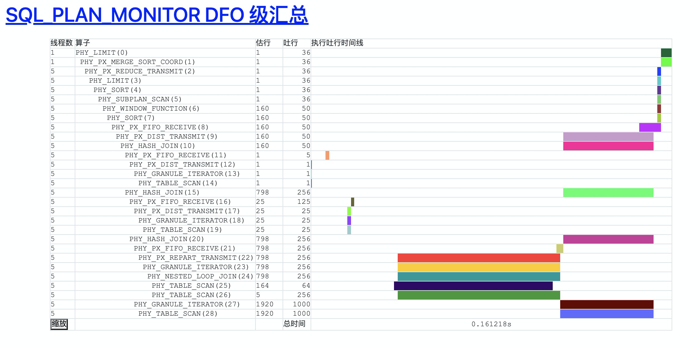

# Oceanbase Monitor Report

OceanBase parallel execution monitor report can help you to diagnosis parallel execution performance in a visual way.

## Usage
进入 mon.sh 所在目录，有两种使用方式：
sh mon.sh -h 127.1 -P 2888 -usys@oracle -Dtest --trace-id=Y1123123-123123
sh mon.sh -h 127.1 -P 2888 -usys@oracle -Dtest --pattern="select c1 from"

注意：**使用对应租户账号**，而不是系统租户账号。

## Feedback

钉钉@晓楚 / 
微信@hustos
